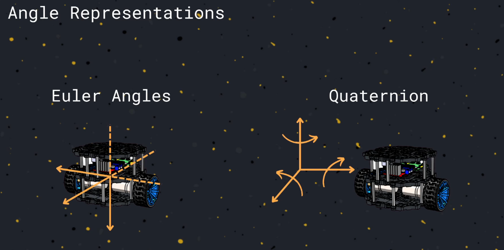
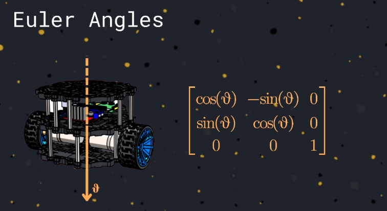
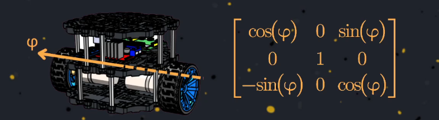
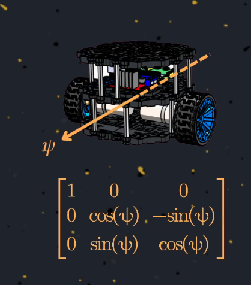
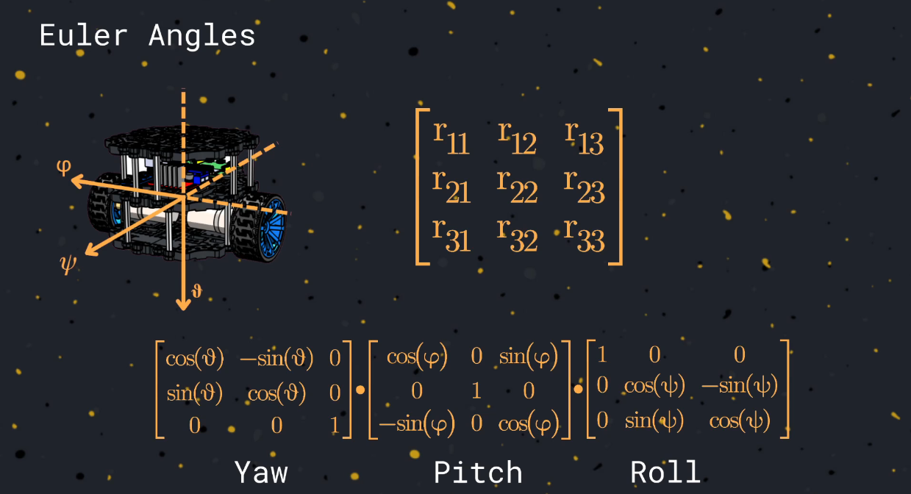

Angle Representations

This document provides an overview of the two most common ways to represent 3D rotations in robotics and computer graphics: **Euler angles (rotation matrices)** and **quaternions**. Each method has its own advantages, disadvantages, and computational characteristics.

---

## 1. Euler Angles & Rotation Matrices

Euler angles describe a rotation in 3D space as a sequence of three elemental rotations about the axes of a coordinate system (commonly denoted as $\theta$, $\phi$, and $\psi$ for Z, Y, and X axes respectively).

### Rotation Matrices for Each Axis

- **Rotation around Z axis ($\theta$):**

  
- **Rotation around Y axis ($\phi$):**

  
- **Rotation around X axis ($\psi$):**

  

### Combined Rotation

In Euler angles, a full 3D rotation is achieved by multiplying three rotation matrices (one for each axis):

**Computational Cost:**

- Requires storing a 3x3 matrix (9 values)
- To combine two rotations: 3 matrix multiplications (3x3), which means 27 products and 18 sums

**Pros:**

- Intuitive and easy to visualize
- Directly relates to physical axes

**Cons:**

- Suffering from gimbal lock (loss of one degree of freedom in certain configurations)
- More computationally expensive for repeated composition
- Not as compact as other representations

---

## 2. Quaternions

Quaternions provide a compact, efficient, and robust way to represent 3D rotations, avoiding many of the pitfalls of Euler angles.

**Definition:**

$$
q = a + bi + cj + dk
$$

Where $a, b, c, d$ are real numbers, and $i, j, k$ are the fundamental quaternion units.

### Important Properties

- **Unitary (Normalization):**

  $$
  a^2 + b^2 + c^2 + d^2 = 1
  $$

  (Unit quaternions represent valid rotations)
- **Rotation Composition:**
  To combine two rotations, multiply their quaternions:

  $$
  q_{total} = q_1 \times q_2
  $$

  (Quaternion multiplication is not commutative)
- **Inverse (Reverse Rotation):**

  $$
  q^{-1} = a - bi - cj - dk
  $$

**Computational Cost:**

- To compose two rotations: 16 products and 12 sums
- Only 4 values need to be stored

**Pros:**

- No gimbal lock
- More efficient for repeated composition
- Compact (4 values)
- Easy to interpolate (slerp)

**Cons:**

- Less intuitive to visualize
- Requires normalization to avoid drift

---

## Practical Notes

- **Euler angles** are often used for user interfaces, animation keyframes, and situations where human interpretability is important.
- **Quaternions** are preferred for internal calculations, robotics, 3D engines, and anywhere robust, efficient rotation handling is needed.

---

## References

- [Wikipedia: Euler angles](https://en.wikipedia.org/wiki/Euler_angles)
- [Wikipedia: Quaternions and spatial rotation](https://en.wikipedia.org/wiki/Quaternions_and_spatial_rotation)

---

*This document summarizes the key differences and computational aspects of Euler angles and quaternions for 3D rotation representation.*
