# Odometry Overview

This note summarizes how we estimate a robot's pose from wheel encoders, common sources of error, and how to mitigate drift.

We describe the robot pose relative to:

- **O**: odom frame (start point)
- **R**: current robot frame
- **M**: map frame (global reference)

This document focuses on odometry within the odom frame (`O→R`). The relation to the map frame (`R→M`) is covered later in mapping/localization.

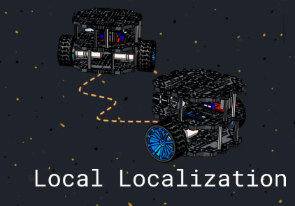

## Local Odometry (Dead Reckoning)

By integrating velocity over time we can track the robot pose relative to the start. Wheel encoders count steps and, combined with the wheel radius, let us convert rotations into linear and angular motion.

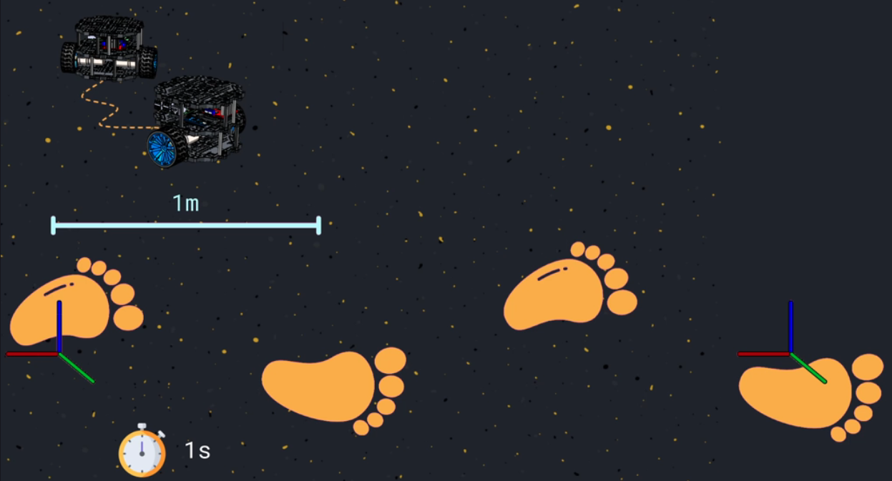

## Wheel Encoders

- **Incremental encoders** emit square waves as a slotted disk interrupts a light source. Frequency gives speed, but direction requires quadrature channels. They do not provide an absolute position after power loss.
- **Absolute encoders** assign a unique binary code to each angular section, so a single reading reveals both position and direction.

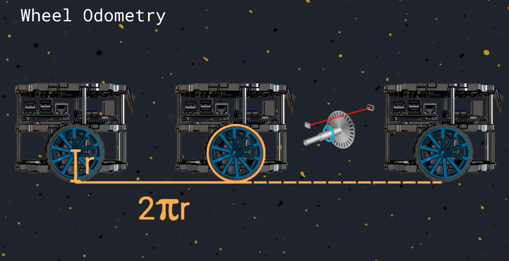
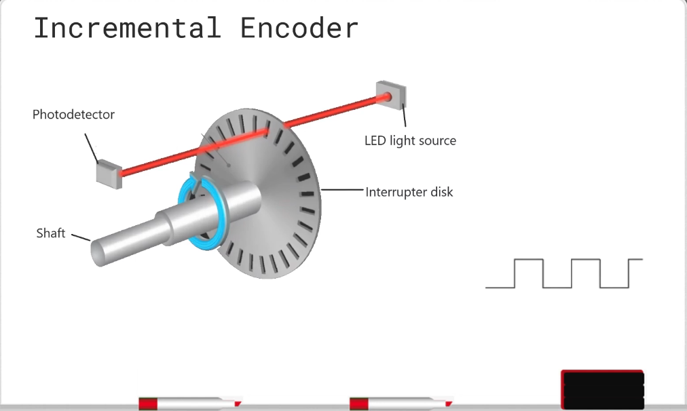
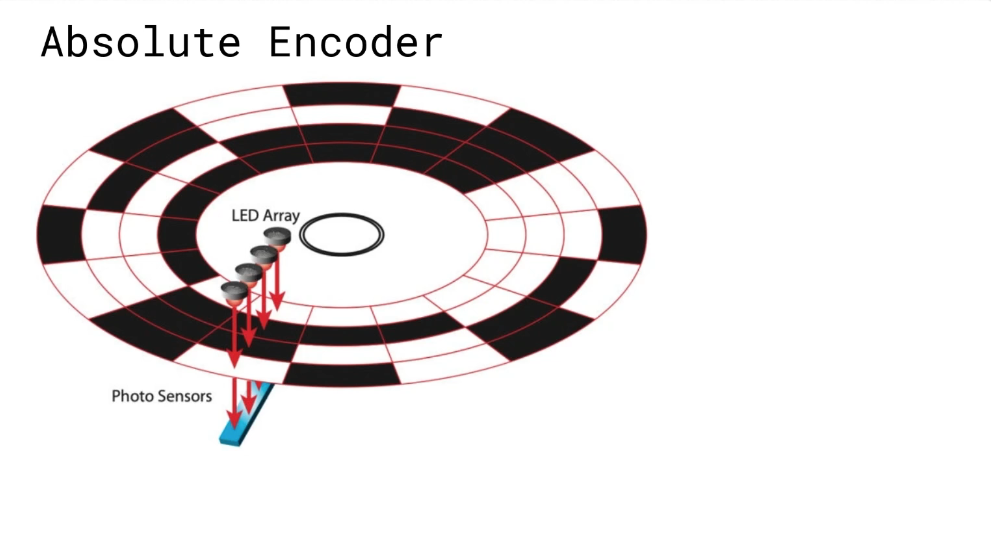
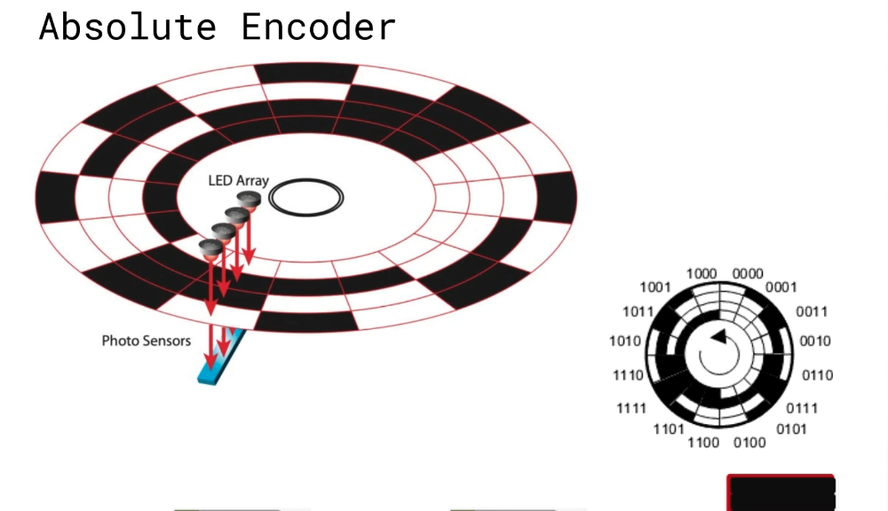

More channels → higher resolution → better pose estimation. Accurate wheel radius calibration is equally important.

## Odometry Error Sources

- Wheel radius mismatch or mounting tolerances
- Poor ground contact or slippage
- Quantization from low-resolution encoders
- Integration drift that accumulates over distance/time

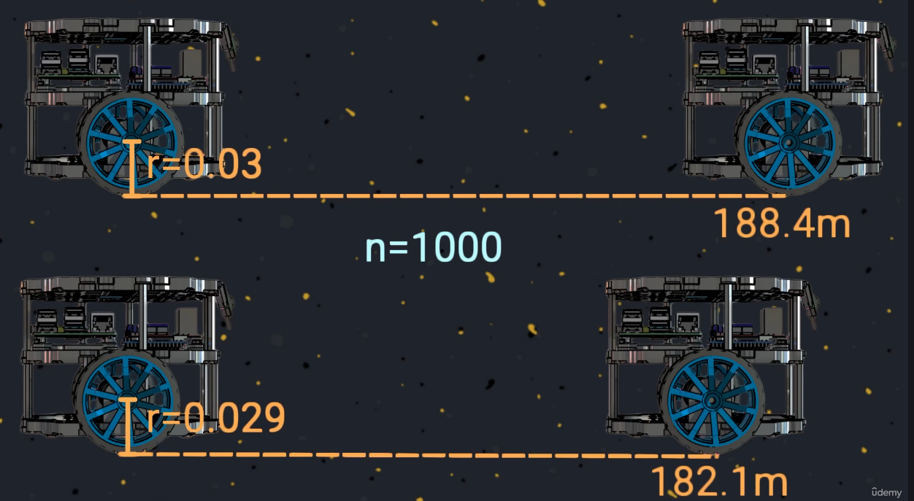
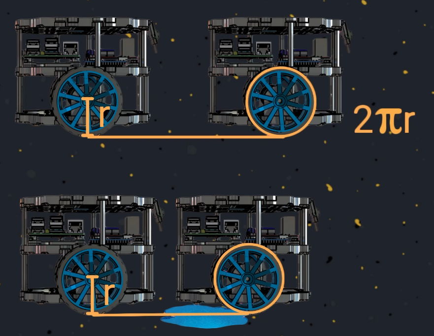

## Improving Accuracy

Two complementary strategies reduce drift and uncertainty:

1) **Sensor fusion**: combine wheel odometry with other sensors (e.g., IMU, lidar, visual odometry) to smooth noise and detect slips.
2) **Global localization**: align odometry to a map of the environment to periodically correct accumulated error (covered in the localization and mapping course).

## Differential Inverse Kinematics

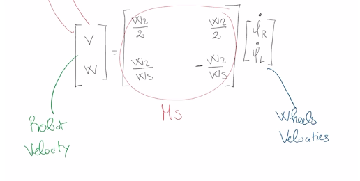

V = (s/t) where s is the distance and t is time

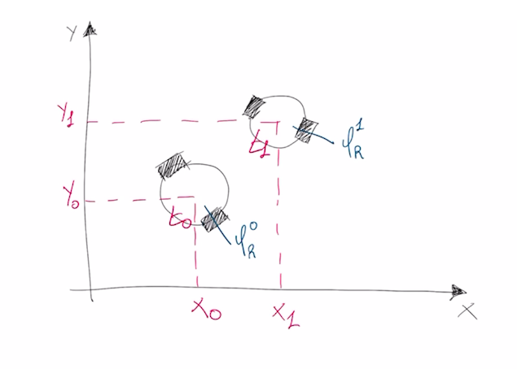

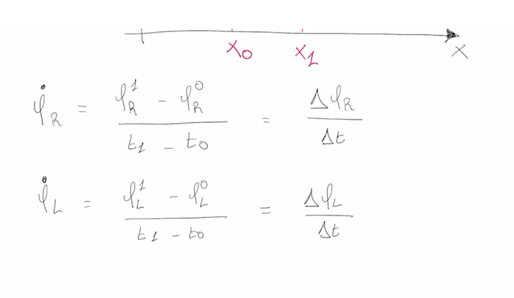

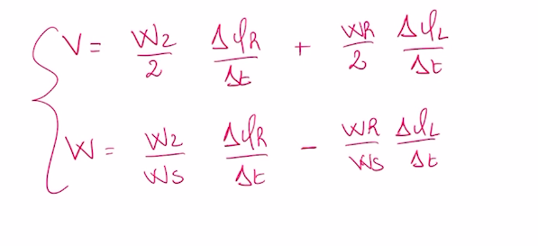
