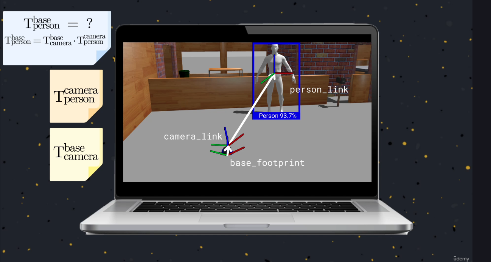
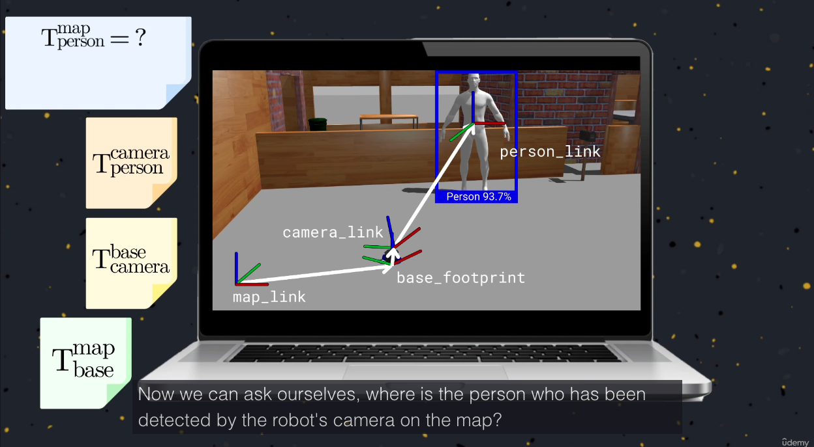
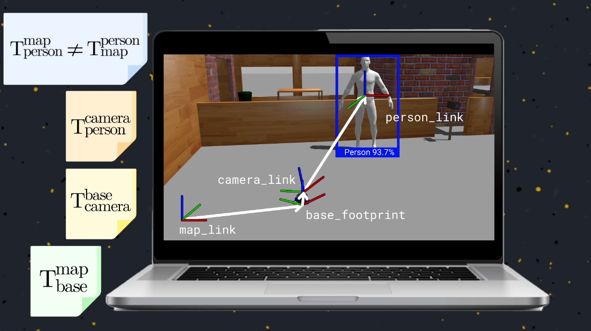
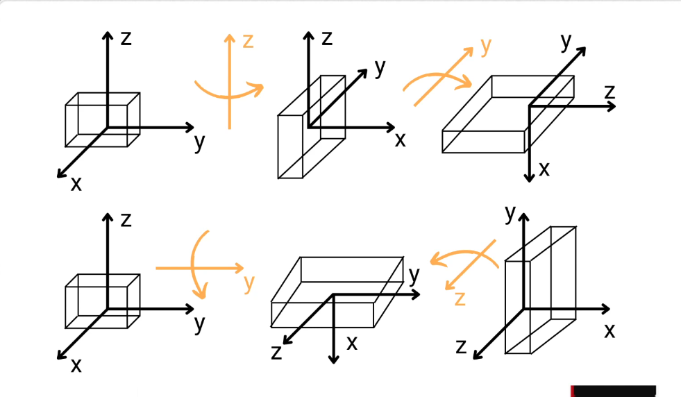

The order of multiplying matrices is very important

Why it is that much important?

While the start is the same (and the axisis mirrored are also the same but in different order) the end is different !!
