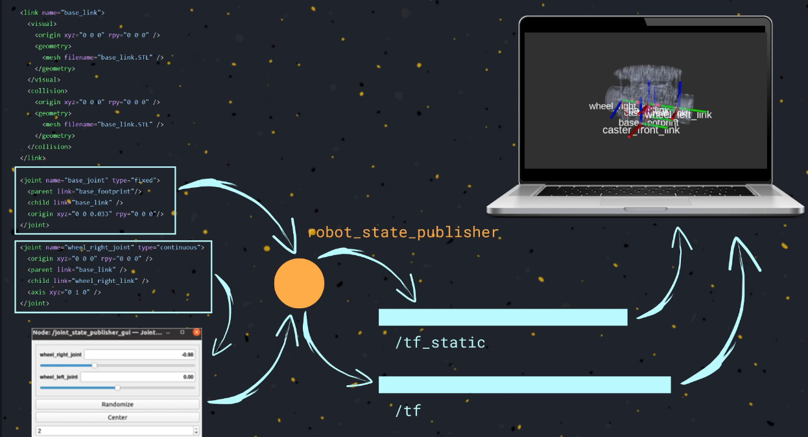

# Static and dynamic

## Explanation

In ROS TF2, transformations between coordinate frames can be either **static** or **dynamic**:

### Static Transformations
- **Definition:** These are transformations that do not change over time. The relationship between the two frames is fixed.
- **Use case:** Used for parts of a robot or environment that are rigidly connected, such as a sensor mounted on a robot base.
- **Implementation:** Published once (or rarely) using the `static_transform_publisher` or similar tools.
- **Example:** The transform between a robot's base and a fixed camera.

### Dynamic Transformations
- **Definition:** These are transformations that change over time, reflecting movement or articulation.
- **Use case:** Used for moving parts, such as a robot arm, wheels, or a mobile robot moving in an environment.
- **Implementation:** Continuously published by a node (e.g., a robot state publisher or localization system) to update the relationship between frames.
- **Example:** The transform between a robot's base and its end-effector as the arm moves.

**Summary:**
- Use static transforms for fixed relationships.
- Use dynamic transforms for moving or changing relationships.
