# Turtlesim Kinematics Example

This guide explains how to run the turtlesim kinematics demonstration with two turtles.

## Prerequisites

- ROS 2 installed and sourced
- `bumperbot_cpp_examples` package built

## Instructions

### 1. Build the Workspace

```bash
cd ~/bumperbot_ws
colcon build
```

### 2. Source the Workspace

```bash
source install/setup.bash
```

### 3. Launch Turtlesim

In a new terminal:

```bash
ros2 run turtlesim turtlesim_node
```

### 4. Spawn a Second Turtle

In a new terminal (source the workspace first):

```bash
ros2 service call /spawn turtlesim/srv/Spawn "{x: 1.0, y: 4.0, theta: 0.0, name: 'turtle2'}"
```

This spawns a second turtle named `turtle2` at position (1.0, 4.0) with orientation 0.0 radians.

### 5. Run the Kinematics Node

In a new terminal (source the workspace first):

```bash
ros2 run bumperbot_cpp_examples simple_turtlesim_kinematics
```

### 6. Control the Turtle

In a new terminal:

```bash
ros2 run turtlesim turtle_teleop_key
```

Use the arrow keys to move `turtle1` and observe the kinematics output.

## Expected Behavior

- Two turtles appear in the turtlesim window
- The kinematics node tracks and displays pose information
- Use arrow keys in the teleop terminal to control `turtle1`

## Troubleshooting

- **Command not found**: Make sure you've sourced the workspace with `source install/setup.bash`
- **Package not found**: Rebuild with `colcon build` and source again

## Transformation matrix

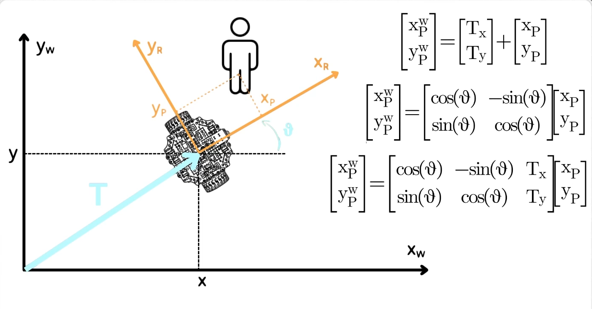

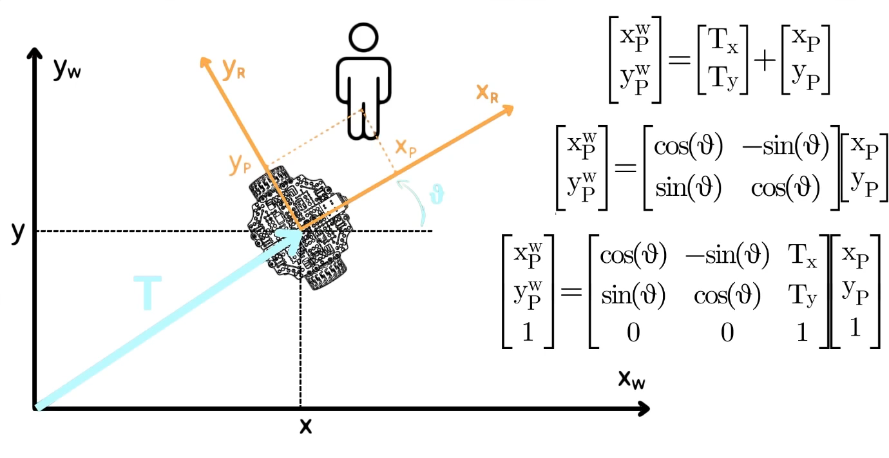

The last matrix is tansformation matrix. Example:

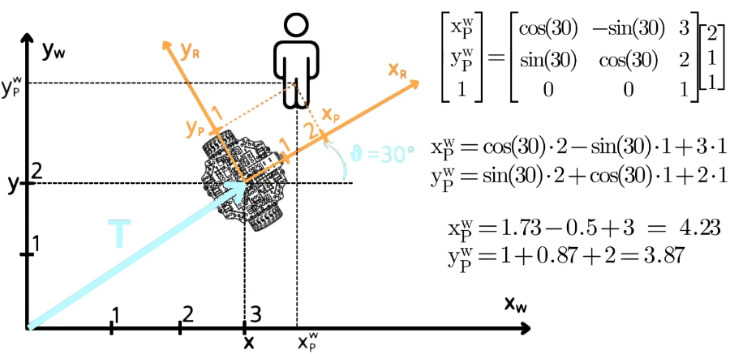

## Velocity of mobile robot

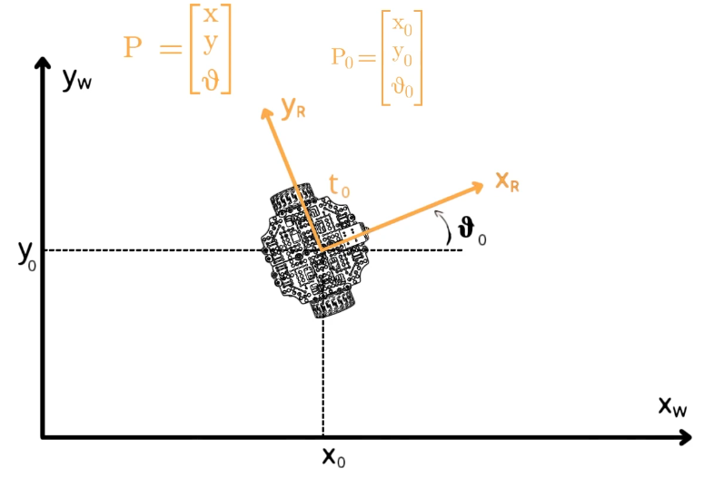

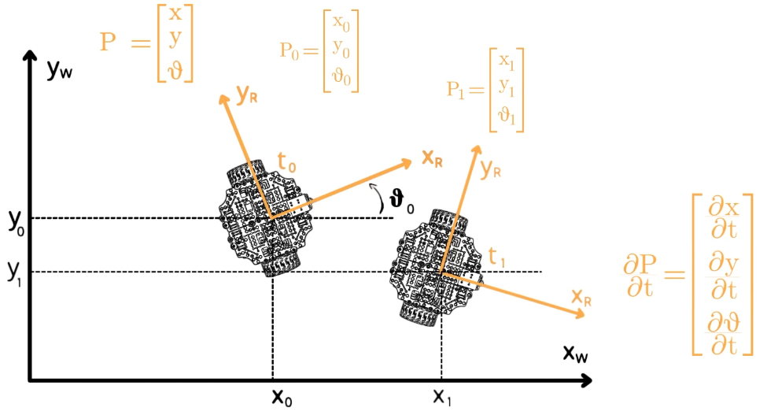

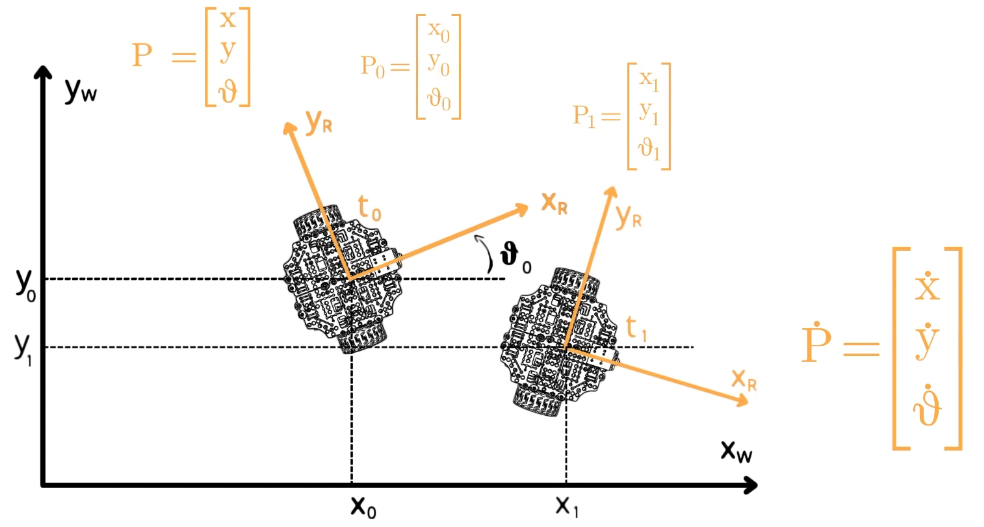

xdot, ydot = linear veleocity

theta dot = angular velociy

P dot is the velocity vector of the robot

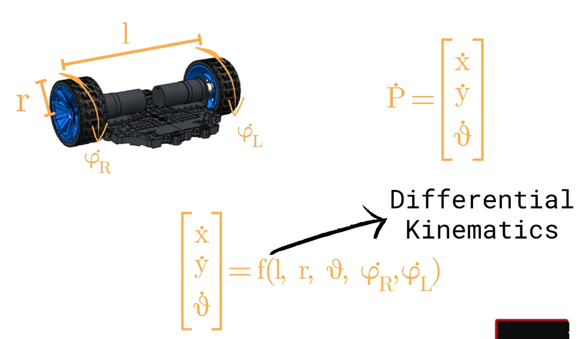

### Linear velocity

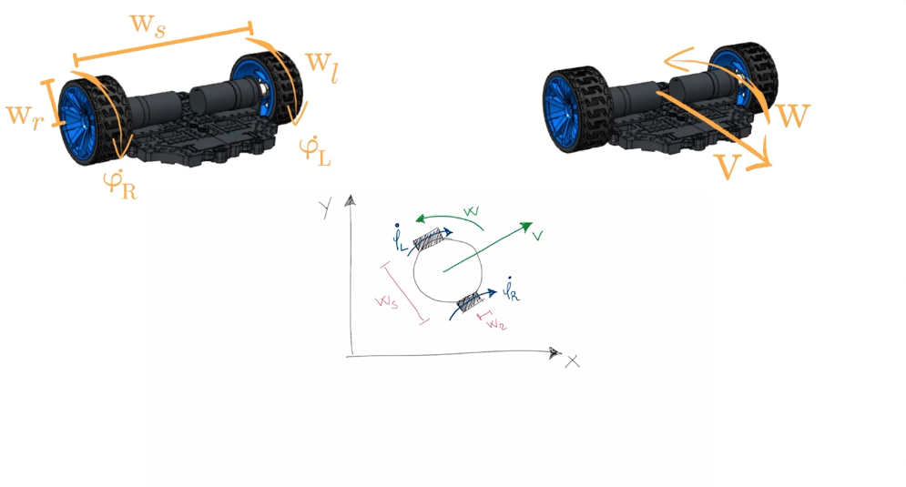

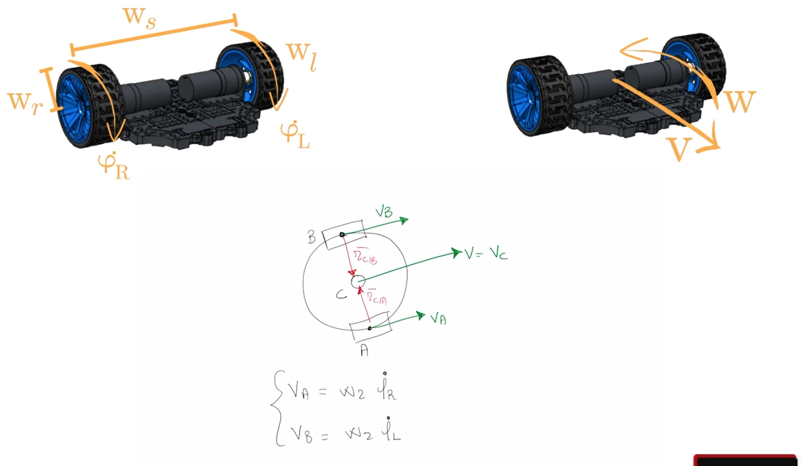

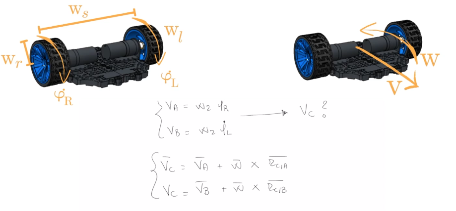

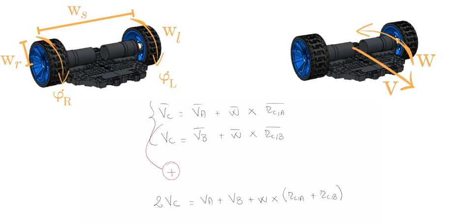

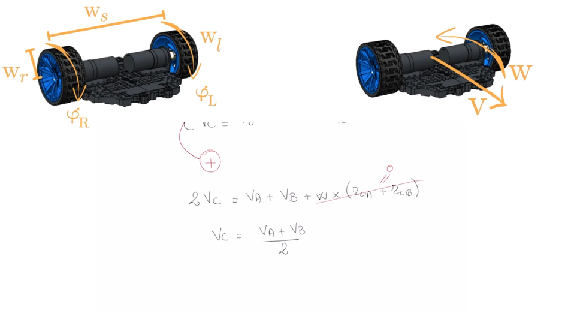

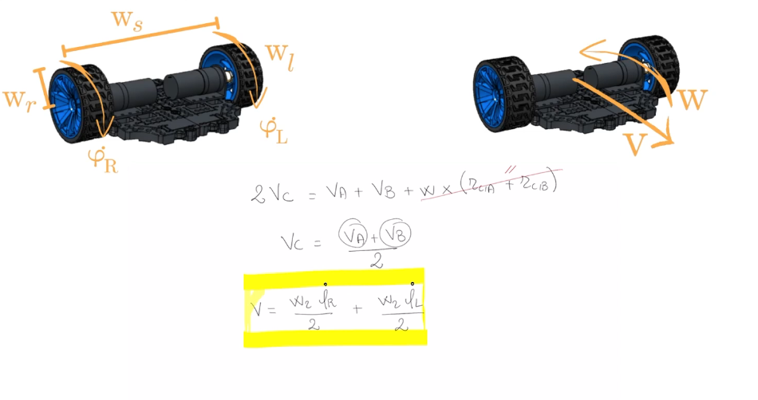

Wr and Wl is the radious of the wheels. Theta dot R and Theta dot L is the angular velocity of the weels. Vc = V

### Angular velocity

To derive the angular velocity we have to substract the two equations now:

Ws = Wheel seperation, distance betwwen two wheel

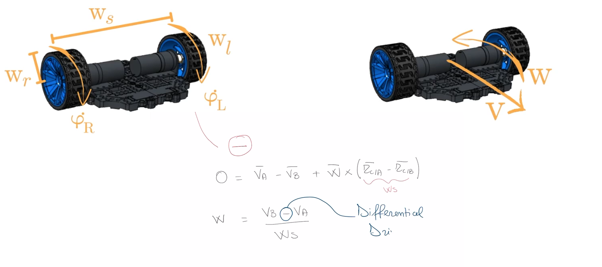

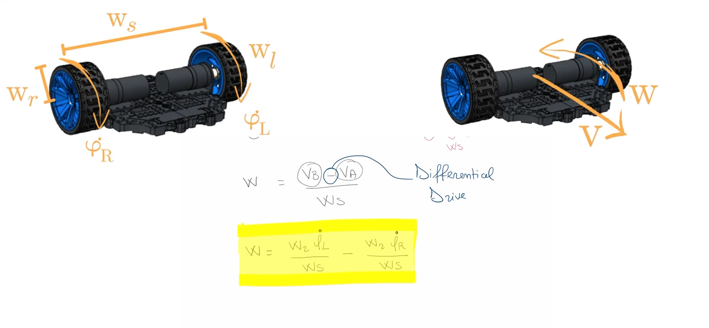


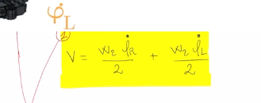

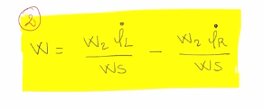

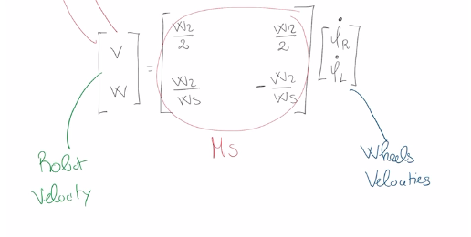

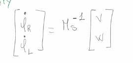
