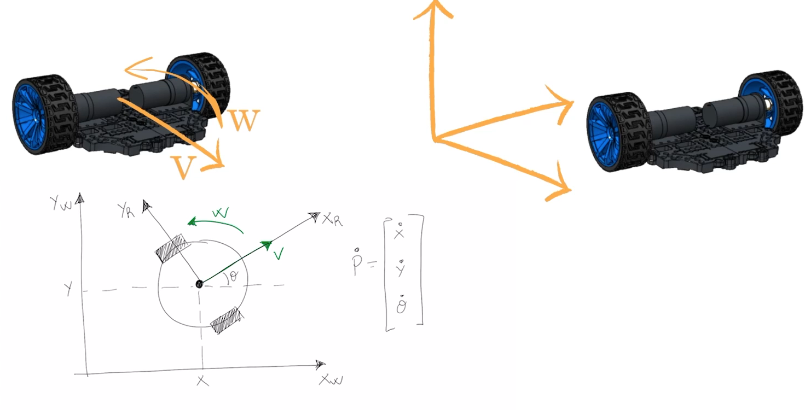
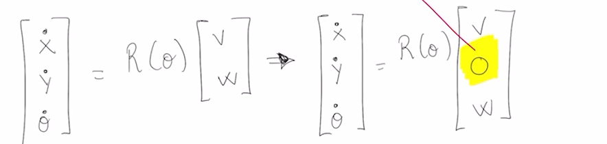
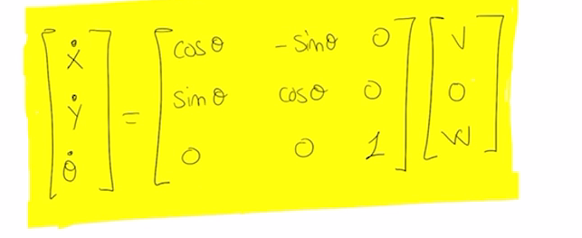
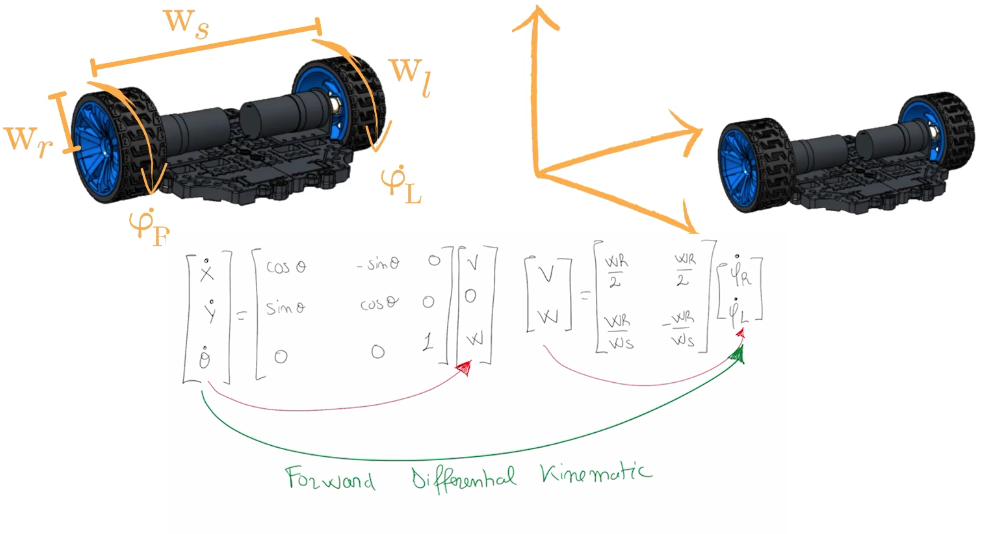
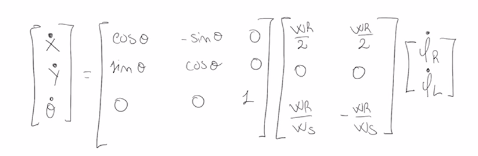
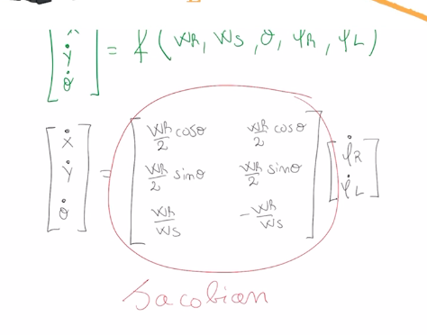

# Turtlesim Kinematics Example

This guide explains how to run the turtlesim kinematics demonstration with two turtles.

## Prerequisites

- ROS 2 installed and sourced
- `bumperbot_cpp_examples` package built

## Instructions

### 1. Build the Workspace

```bash
cd ~/bumperbot_ws
colcon build
```

### 2. Source the Workspace

```bash
source install/setup.bash
```

### 3. Launch Turtlesim

In a new terminal:

```bash
ros2 run turtlesim turtlesim_node
```

### 4. Spawn a Second Turtle

In a new terminal (source the workspace first):

```bash
ros2 service call /spawn turtlesim/srv/Spawn "{x: 1.0, y: 4.0, theta: 0.0, name: 'turtle2'}"
```

This spawns a second turtle named `turtle2` at position (1.0, 4.0) with orientation 0.0 radians.

### 5. Run the Kinematics Node

In a new terminal (source the workspace first):

```bash
ros2 run bumperbot_cpp_examples simple_turtlesim_kinematics
```

### 6. Control the Turtle

In a new terminal:

```bash
ros2 run turtlesim turtle_teleop_key
```

Use the arrow keys to move `turtle1` and observe the kinematics output.

## Expected Behavior

- Two turtles appear in the turtlesim window
- The kinematics node tracks and displays pose information
- Use arrow keys in the teleop terminal to control `turtle1`

## Troubleshooting

- **Command not found**: Make sure you've sourced the workspace with `source install/setup.bash`
- **Package not found**: Rebuild with `colcon build` and source again

## Transformation matrix


The last matrix is tansformation matrix. Example:


## Velocity of mobile robot


xdot, ydot = linear veleocity

theta dot = angular velociy

P dot is the velocity vector of the robot


### Linear velocity


Wr and Wl is the radious of the wheels. Theta dot R and Theta dot L is the angular velocity of the weels. Vc = V

### Angular velocity

To derive the angular velocity we have to substract the two equations now:

Ws = Wheel seperation, distance betwwen two wheel


### Velocity in World frame



There is just Vx, Vy is zero because of the wheels and differential drive architecture





### Differential forward kinematics







### Simple speed controller

In this lesson, a simple velocity controller application is
implemented for a robot using joystick input. By revisiting the
differential kinematics equation, joystick commands are converted into
the robot’s movements. The aim is to allow the robot’s speed and
direction to be intuitively controlled by the user through the joystick.

The lesson explains the process of publishing velocity messages from
the joystick on a specific topic, enabling the robot to receive velocity
 commands. For example, the goal is for the robot to receive commands
such as moving straight at one meter per second or rotating in place at
one radian per second. However, a challenge arises in converting these
commands from the robot’s reference frame into individual wheel
velocities.

To address this, a new ROS 2 node will be developed. This node will
subscribe to the joystick’s velocity topic, and when a new message is
received, it will compute appropriate commands for each wheel using the
differential kinematics equation. These commands will then be published
to the respective topics that control the robot’s wheels.

Overall, the lesson emphasizes the importance of understanding the
relationship between joystick inputs and the robot’s wheel motions,
enabling effective real-time control of the robot.
